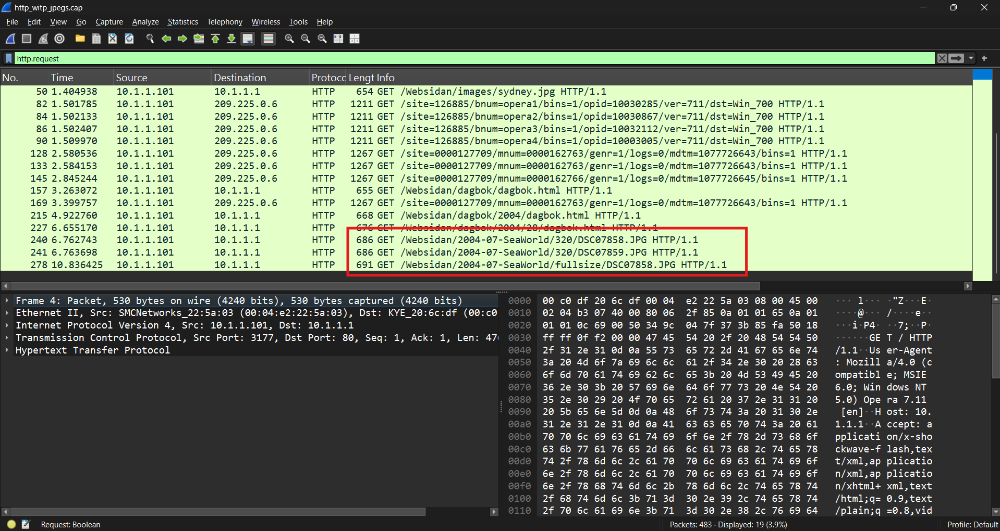
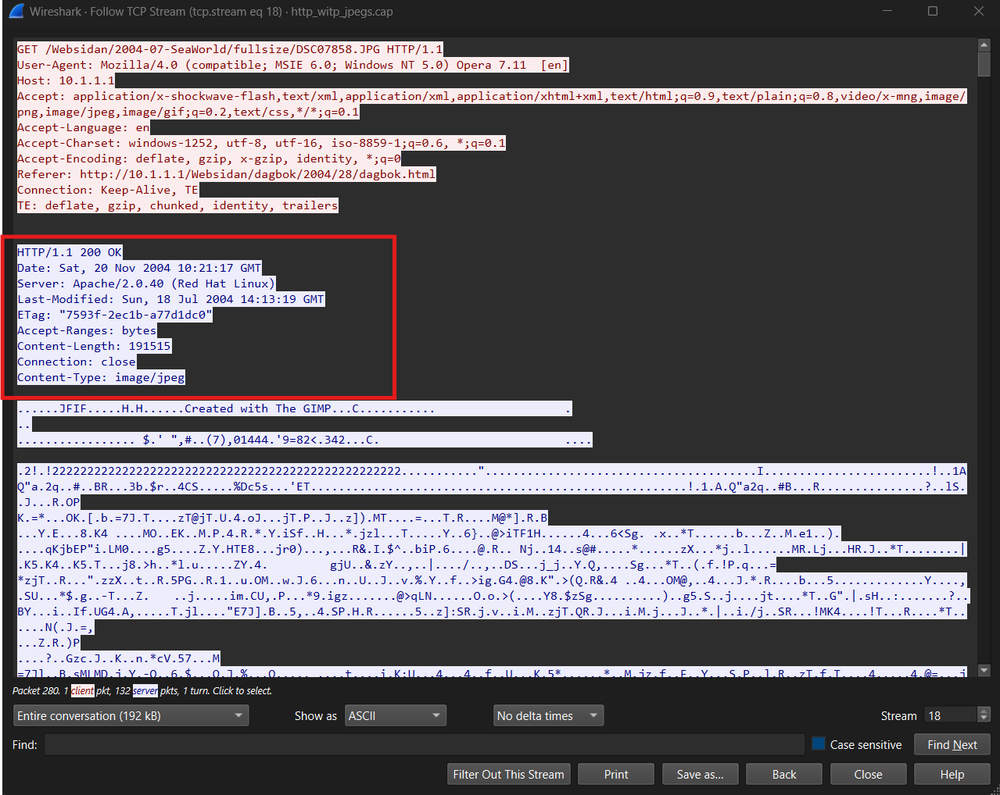
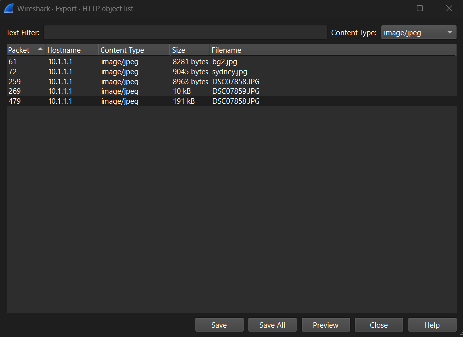

# HTTP Object Recovery

## Scenario

A packet capture containing web browsing traffic was analyzed to identify the primary communicating hosts, examine HTTP activity, and determine whether transferred files could be recovered from the network traffic.

Because the web traffic uses unencrypted HTTP rather than HTTPS, application-layer information such as requested URLs, HTTP headers, and transferred files is visible directly within the packet capture.

## Objectives

* Identify the primary client and web server
* Examine HTTP requests and responses
* Identify image files transferred over the network
* Reconstruct an HTTP session
* Recover transferred JPEG files from the packet capture
* Demonstrate the security implications of unencrypted HTTP traffic

## Initial Triage

| Item                 | Finding              |
| -------------------- | -------------------- |
| Total Packets        | 483                  |
| Capture Duration     | ~11.38 seconds       |
| Primary Client       | `10.1.1.101`         |
| Primary Local Server | `10.1.1.1`           |
| Application Protocol | HTTP                 |
| Server Port          | TCP/80               |
| Primary Content      | HTML and JPEG images |

The majority of the capture consists of communication between `10.1.1.101` and `10.1.1.1`.

Additional HTTP traffic occurs between the client and external addresses, including `209.225.0.6` and `209.225.11.237`. This traffic is associated with Opera browser services and advertising infrastructure and was not the primary focus of the investigation.

## Analysis

### 1. Primary Hosts Identified

<p align="center">
  
  <br/>
  <em>Ipv4 Conversations</em>
</p>

Reviewing IPv4 conversations showed significant communication between:

```text
10.1.1.101 <-> 10.1.1.1
```

Inspection of the HTTP traffic established the roles of the systems:

```text
10.1.1.101 = HTTP client
10.1.1.1   = HTTP web server
```

The client initiated connections to TCP port 80 and requested resources from the server.

Useful Wireshark filters:

```text
http

ip.addr == 10.1.1.101

ip.addr == 10.1.1.1

tcp.port == 80
```

---

### 2. HTTP Requests Examined

<p align="center">
  
  <br/>
  <em>HTTP Requests</em>
</p>

Filtering for HTTP requests:

```text
http.request
```

revealed normal web browsing activity.

Examples include:

```text
GET / HTTP/1.1

GET /Websidan/index.html HTTP/1.1

GET /Websidan/images/bg2.jpg HTTP/1.1

GET /Websidan/images/sydney.jpg HTTP/1.1
```

Later requests referenced photographs associated with a SeaWorld directory:

```text
GET /Websidan/2004-07-SeaWorld/320/DSC07858.JPG HTTP/1.1

GET /Websidan/2004-07-SeaWorld/320/DSC07859.JPG HTTP/1.1

GET /Websidan/2004-07-SeaWorld/fullsize/DSC07858.JPG HTTP/1.1
```

The HTTP headers also reveal information about the client browser:

```text
User-Agent: Mozilla/4.0 (compatible; MSIE 6.0; Windows NT 5.0) Opera 7.11 [en]
Host: 10.1.1.1
```

This demonstrates that unencrypted HTTP exposes not only requested resources but also information about the client software.

---

### 3. JPEG Transfers Identified

<p align="center">
  
  <br/>
  <em>Fullsize HTTP Stream</em>
</p>

HTTP responses from `10.1.1.1` contained the MIME type:

```text
Content-Type: image/jpeg
```

These responses can be isolated with:

```text
http.content_type == "image/jpeg"
```

Several JPEG files were transferred during the capture.

Examples included:

```text
/Websidan/images/bg2.jpg
Content-Length: 8281

/Websidan/images/sydney.jpg
Content-Length: 9045

/Websidan/2004-07-SeaWorld/320/DSC07858.JPG
Content-Length: 8963

/Websidan/2004-07-SeaWorld/320/DSC07859.JPG
Content-Length: 10730
```

A significantly larger image was subsequently requested:

```text
/Websidan/2004-07-SeaWorld/fullsize/DSC07858.JPG
```

The server responded:

```text
HTTP/1.1 200 OK
Server: Apache/2.0.40 (Red Hat Linux)
Content-Length: 191515
Content-Type: image/jpeg
```

This indicates that the client first accessed a smaller image and later requested a full-size version of the same photograph.

---

### 4. HTTP Session Reconstruction

<p align="center">
  
  <br/>
  <em>Export HTTP Objects</em>
</p>

The full-size image request can be examined by following its TCP stream.

The client request contains:

```text
GET /Websidan/2004-07-SeaWorld/fullsize/DSC07858.JPG HTTP/1.1
Host: 10.1.1.1
```

The corresponding server response contains:

```text
HTTP/1.1 200 OK
Server: Apache/2.0.40 (Red Hat Linux)
Content-Length: 191515
Content-Type: image/jpeg
```

Wireshark reconstructs the application-layer conversation from the individual TCP segments, allowing the original HTTP exchange to be viewed as a continuous stream.

This demonstrates how packet analysis can reconstruct higher-level user activity from network traffic.

---

### 5. HTTP Object Recovery

Because the image content was transmitted through unencrypted HTTP, Wireshark can reconstruct the transferred files.

Using:

```text
File -> Export Objects -> HTTP
```

displays the HTTP objects identified in the capture.

JPEG files such as the following can be exported:

```text
bg2.jpg
sydney.jpg
DSC07858.JPG
DSC07859.JPG
```

The full-size `DSC07858.JPG` can also be reconstructed from the HTTP session.

Successful recovery of the image demonstrates that an observer with access to unencrypted network traffic may be able to recover complete files rather than merely viewing packet metadata.

<p align="center">
  
  <br/>
  <em>Recovered DSC07858 Image</em>
</p>

## Indicators and Artifacts

| Type                | Value                         |
| ------------------- | ----------------------------- |
| Client IP           | `10.1.1.101`                  |
| Web Server          | `10.1.1.1`                    |
| Protocol            | HTTP                          |
| Server Port         | TCP/80                        |
| Web Server Software | Apache/2.0.40 (Red Hat Linux) |
| Browser             | Opera 7.11                    |
| Image               | `DSC07858.JPG`                |
| Full Image Size     | 191,515 bytes                 |
| MIME Type           | `image/jpeg`                  |

These values represent artifacts observed during the analysis rather than malicious indicators of compromise.

## Security Significance

The capture demonstrates one of the primary weaknesses of unencrypted HTTP.

An observer with access to the network traffic can identify:

* Source and destination systems
* Requested URLs and file names
* Browser and client information
* HTTP request and response headers
* Transferred files
* Web content viewed by the client

In this capture, complete JPEG images can be reconstructed directly from the network traffic.

HTTPS mitigates this exposure by encrypting application-layer communication between the client and server. Although some connection metadata may remain observable, the HTTP request paths and transferred image contents would normally not be readable without access to the appropriate encryption keys.

## Useful Wireshark Filters

```text
# Display all HTTP traffic
http

# Display HTTP requests
http.request

# Display JPEG HTTP responses
http.content_type == "image/jpeg"

# Traffic involving the client
ip.addr == 10.1.1.101

# Traffic involving the local server
ip.addr == 10.1.1.1

# HTTP traffic between the primary client and server
ip.addr == 10.1.1.101 && ip.addr == 10.1.1.1 && tcp.port == 80
```

## Conclusion

Analysis of the packet capture identified `10.1.1.101` as a client browsing an HTTP web server at `10.1.1.1`.

The session included HTML pages and multiple JPEG images transferred over TCP port 80. Because HTTP provided no encryption, Wireshark could expose requested file paths, HTTP headers, browser information, and the contents of transferred files.

The investigation culminated in reconstruction and recovery of JPEG files from the packet capture, including a 191,515-byte full-size copy of `DSC07858.JPG`.

This analysis demonstrates how packet captures can be used to reconstruct application-layer activity and illustrates why sensitive web traffic should be protected using encrypted protocols such as HTTPS.
