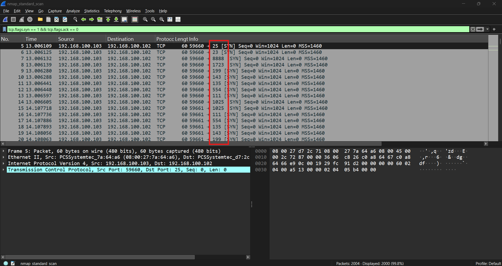
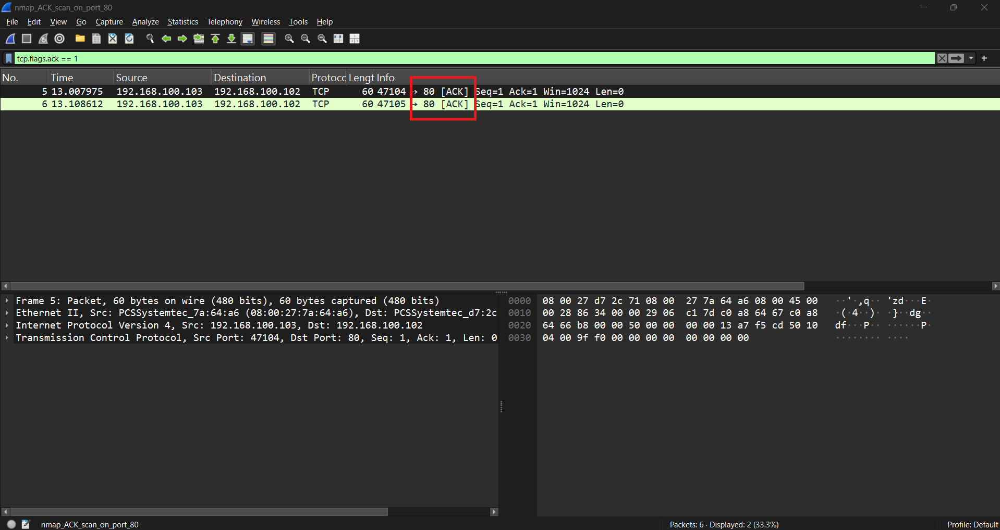
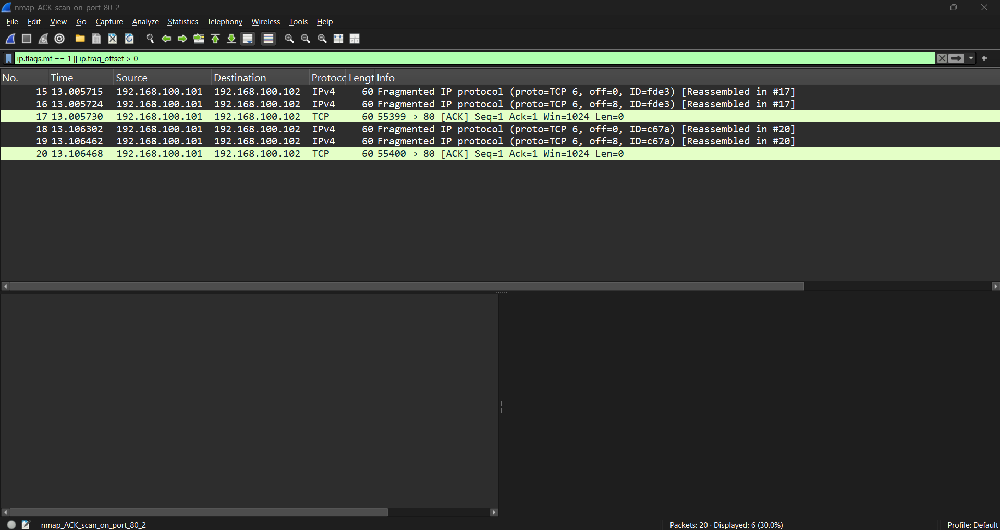
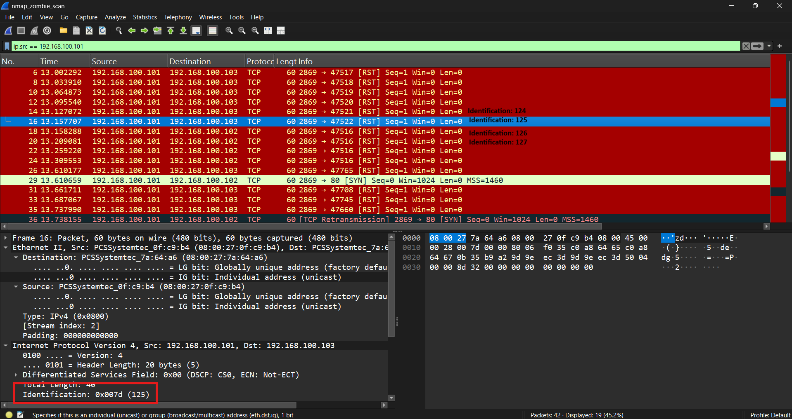
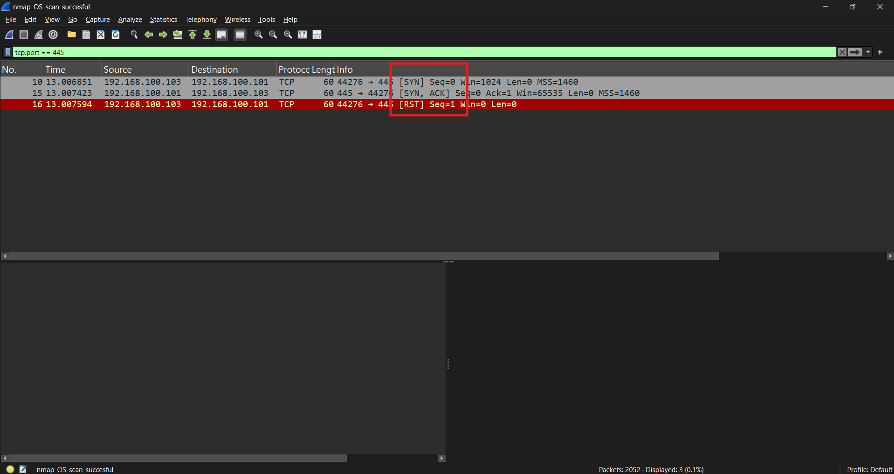

# Nmap Scan Analysis

## Scenario

A collection of packet captures generated by several Nmap scanning techniques was analyzed to determine how reconnaissance activity appears at the network level.

The captures include:

* Default Nmap port scanning
* ACK scanning
* Fragmented and source-spoofed ACK scanning
* Idle/Zombie scanning
* Failed OS fingerprinting
* Successful OS fingerprinting

The objective was to identify the systems involved, compare packet patterns between scan types, and determine which network characteristics can be used to recognize reconnaissance activity.

## Objectives

* Identify the scanner and target systems
* Recognize TCP SYN-based port scanning
* Examine ACK scanning behavior
* Identify IP fragmentation and source spoofing
* Analyze an Nmap idle/zombie scan
* Compare failed and successful OS fingerprinting
* Develop Wireshark filters useful for detecting reconnaissance

## Environment

| Role                           | Address           |
| ------------------------------ | ----------------- |
| Scanner                        | `192.168.100.103` |
| Primary Target                 | `192.168.100.102` |
| Secondary Target / Zombie Host | `192.168.100.101` |

The exact role of `192.168.100.101` varies between captures. It is used as the zombie host during the idle scan and as the target during the successful OS fingerprinting capture.

---

## Analysis

### 1. Default Nmap Scan

<p align="center">
  
  <br/>
  <em>Standard SYN Scan</em>
</p>

The standard scan capture contains approximately:

```text
2,004 packets
~34 seconds
```

The primary communication is:

```text
192.168.100.103 -> 192.168.100.102
```

Filtering for initial TCP SYN packets:

```text
tcp.flags.syn == 1 && tcp.flags.ack == 0
```

reveals a large number of connection attempts toward many different destination ports.

Examples include:

```text
TCP/25
TCP/23
TCP/8888
TCP/1723
TCP/199
TCP/143
TCP/135
TCP/554
TCP/111
TCP/1025
TCP/3389
TCP/8080
```

Approximately 2,000 SYN packets appear in the capture.

The source repeatedly probes many destination ports over a short period of time, which is characteristic of automated port enumeration.

The packets use a TCP window size of:

```text
1024
```

and the same source port is reused across groups of destination ports.

The capture does not contain corresponding TCP responses from the target for the large SYN sweep. From the capture alone, this behavior is consistent with probes being silently filtered or otherwise unanswered.

### Detection Characteristic

A useful indicator of port scanning is:

> One source sending TCP SYN packets to a large number of destination ports on one host within a short time period.

A basic Wireshark filter is:

```text
ip.src == 192.168.100.103 &&
ip.dst == 192.168.100.102 &&
tcp.flags.syn == 1 &&
tcp.flags.ack == 0
```

---

### 2. ACK Scan

<p align="center">
  
  <br/>
  <em>ACK Scan</em>
</p>

A separate capture contains an ACK scan directed specifically at TCP port 80.

The traffic contains packets such as:

```text
192.168.100.103 -> 192.168.100.102

TCP Source Port: 47104
TCP Destination Port: 80
Flags: ACK
```

followed by another probe using a different source port:

```text
TCP Source Port: 47105
TCP Destination Port: 80
Flags: ACK
```

Unlike a normal TCP connection, these packets contain the ACK flag without first completing the expected:

```text
SYN
SYN/ACK
ACK
```

three-way handshake.

This makes the traffic unusual when examined in context.

An ACK scan is primarily useful for determining firewall behavior rather than directly determining whether a TCP service is open.

For example, an unsolicited ACK reaching an unfiltered host would commonly cause a TCP RST response, while a firewall may silently discard the probe.

Filter:

```text
tcp.flags.ack == 1 &&
tcp.flags.syn == 0 &&
tcp.dstport == 80
```

---

### 3. Fragmented and Source-Spoofed ACK Scan

<p align="center">
  
  <br/>
  <em>Fragmented Spoofed IP Scan Scan</em>
</p>

Another ACK scan attempts to make detection more difficult by using both:

* IP fragmentation
* A spoofed source IP address

The actual scanner remains:

```text
192.168.100.103
```

but the TCP probes appear on the network as originating from:

```text
192.168.100.101
```

and target:

```text
192.168.100.102
```

The ACK probes are fragmented into several small IPv4 fragments.

Individual probes are split into three fragments with offsets similar to:

```text
Fragment 1:
Offset: 0
More Fragments: Set

Fragment 2:
Offset: 1
More Fragments: Set

Fragment 3:
Offset: 2
More Fragments: Not Set
```

This means a monitoring system must reconstruct the IPv4 datagram before it can fully interpret the embedded TCP header.

Useful filter:

```text
ip.flags.mf == 1 || ip.frag_offset > 0
```

The capture therefore demonstrates an important detection consideration:

> Inspecting packets individually without fragment reassembly can hide or obscure transport-layer information.

The spoofed address also demonstrates why a packet's source IP should not always be assumed to identify the physical system that generated the traffic.

---

### 4. Idle / Zombie Scan

<p align="center">
  
  <br/>
  <em>Zombie IPID Scan</em>
</p>

The zombie scan is the most complex technique in the collection.

Three hosts participate:

```text
Scanner: 192.168.100.103
Zombie:  192.168.100.101
Target:  192.168.100.102
```

The scan tests:

```text
TCP/80
```

while using TCP port:

```text
2869
```

on the zombie host for probing.

The scanner first repeatedly communicates with the zombie:

```text
192.168.100.103 -> 192.168.100.101:2869
```

The zombie responds with TCP reset packets.

The IPv4 Identification values in the zombie's responses increase sequentially:

```text
120
121
122
123
124
125
...
130
131
132
133
134
135
136
```

This predictable IP ID behavior is what makes the host useful for an idle scan.

During the actual target probe, packets appear as:

```text
192.168.100.101 -> 192.168.100.102:80
```

rather than:

```text
192.168.100.103 -> 192.168.100.102:80
```

Therefore, from the target's perspective, the apparent scanner is the zombie host.

Two SYN packets in the capture use:

```text
Source:      192.168.100.101
Destination: 192.168.100.102
Source Port: 2869
Destination: 80
Flags:       SYN
```

Meanwhile, the real scanner continues probing `192.168.100.101:2869` and observing changes in the zombie's IPv4 Identification sequence.

### Security Significance

An idle scan allows the scanning system to avoid directly sending its true source address to the target during the port probe.

However, the technique creates additional communication between the scanner and the zombie, making analysis from a broader network vantage point capable of revealing the relationship.

Useful filters include:

```text
ip.addr == 192.168.100.101 && tcp.port == 2869
```

and:

```text
ip.src == 192.168.100.101 &&
ip.dst == 192.168.100.102 &&
tcp.dstport == 80
```

Examining:

```text
Internet Protocol Version 4 -> Identification
```

also exposes the sequential IP ID behavior.

---

### 5. Failed OS Fingerprinting

The failed OS scan targets:

```text
192.168.100.102
```

from:

```text
192.168.100.103
```

The capture contains approximately:

```text
2,056 packets
~36.6 seconds
```

Nmap first performs extensive port probing.

A large portion of the traffic consists of SYN packets toward many ports.

Later, additional fingerprinting probes use several unusual TCP flag combinations, including:

```text
SYN
ACK
FIN + PSH + URG
```

There are also ICMP and UDP probes.

The OS scan therefore differs noticeably from a simple port scan because Nmap sends deliberately varied packets designed to evaluate characteristics of the remote TCP/IP stack.

Examples of characteristics useful for OS fingerprinting include:

* TCP flags
* TCP window sizes
* TCP options
* IP ID behavior
* TTL values
* ICMP responses
* Responses to unusual TCP combinations

In this capture, however, the target does not provide the combination of open and closed port responses required by Nmap for reliable OS fingerprinting.

The scan therefore fails to produce a successful operating-system identification.

---

### 6. Successful OS Fingerprinting

<p align="center">
  
  <br/>
  <em>OF Fingerprint Scan With Open Port</em>
</p>

The successful OS scan instead targets:

```text
192.168.100.101
```

from:

```text
192.168.100.103
```

The capture contains approximately:

```text
2,052 packets
~18.9 seconds
```

Unlike the unsuccessful capture, this host actively responds to several probes.

For example, the scanner sends:

```text
192.168.100.103 -> 192.168.100.101

TCP SYN
Destination Port: 445
```

and receives:

```text
192.168.100.101 -> 192.168.100.103

TCP SYN, ACK
Source Port: 445
```

This demonstrates that TCP port 445 is open.

The scanner then immediately terminates the incomplete connection using:

```text
RST
```

The capture also contains RST responses associated with closed ports.

Having observable behavior from both an open and closed TCP port gives Nmap additional information for TCP/IP stack fingerprinting.

The fingerprinting stage includes several deliberately unusual probes, including combinations such as:

```text
SYN

SYN + ECE + CWR

No TCP flags

FIN + SYN + PSH + URG

FIN + PSH + URG

ACK
```

These packets are not representative of ordinary application communication. Their purpose is to observe how the target operating system's network stack responds to unusual or edge-case TCP conditions.

---

## Comparison of Scan Techniques

| Technique      | Primary Behavior                      | Key Network Indicator                           |
| -------------- | ------------------------------------- | ----------------------------------------------- |
| Standard Scan  | SYN probes across many ports          | Large number of SYN packets from one source     |
| ACK Scan       | Unsolicited ACK packets               | ACK without an established TCP session          |
| Fragmented ACK | ACK probe split across IP fragments   | Small fragments requiring reassembly            |
| Spoofed Scan   | False source address                  | Apparent source differs from actual scanner     |
| Zombie Scan    | Third-party host used for probing     | Predictable IP IDs and indirect target probes   |
| OS Scan        | Specially crafted TCP/UDP/ICMP probes | Unusual flag combinations and response analysis |

---

## Indicators

| Item                                  | Value             |
| ------------------------------------- | ----------------- |
| Scanner                               | `192.168.100.103` |
| Primary Target                        | `192.168.100.102` |
| Zombie / Secondary Target             | `192.168.100.101` |
| ACK Scan Port                         | TCP/80            |
| Zombie Probe Port                     | TCP/2869          |
| Successful OS Scan Open Port Observed | TCP/445           |
| Primary Protocol                      | TCP               |
| Supporting Protocols                  | UDP, ICMP, ARP    |

These addresses and behaviors are artifacts of the controlled sample captures and are not indicators of compromise.

---

## Useful Wireshark Filters

```text
# SYN probes
tcp.flags.syn == 1 && tcp.flags.ack == 0

# Pure ACK-style probes
tcp.flags.ack == 1 &&
tcp.flags.syn == 0 &&
tcp.flags.reset == 0

# Scanner to primary target
ip.src == 192.168.100.103 &&
ip.dst == 192.168.100.102

# ACK scan of port 80
tcp.dstport == 80 && tcp.flags.ack == 1

# IPv4 fragmentation
ip.flags.mf == 1 || ip.frag_offset > 0

# Zombie traffic
ip.addr == 192.168.100.101 && tcp.port == 2869

# Apparent zombie-to-target scan
ip.src == 192.168.100.101 &&
ip.dst == 192.168.100.102 &&
tcp.dstport == 80

# Successful responses from target
ip.src == 192.168.100.101 &&
tcp.flags.syn == 1 &&
tcp.flags.ack == 1

# TCP resets
tcp.flags.reset == 1
```

## Security Significance

Network reconnaissance produces recognizable traffic patterns even when an attacker attempts to modify the scan technique.

A straightforward port scan generates a large volume of SYN probes, while ACK scanning uses packets inconsistent with normal TCP connection establishment. Fragmentation can obscure transport-layer headers, source spoofing can misrepresent the origin of a probe, and idle scanning can cause a third-party system to appear responsible for scanning activity.

OS fingerprinting generates an additional category of identifiable behavior because the scanner deliberately sends abnormal TCP, UDP, and ICMP probes and observes how the host responds.

These captures demonstrate why network detection should consider behavior across multiple packets rather than evaluating isolated packets independently.

## Conclusion

Analysis of the Nmap capture collection demonstrated several distinct forms of network reconnaissance.

The default scan produced a high-volume SYN sweep across many destination ports. ACK scanning generated unsolicited ACK packets designed to evaluate filtering behavior. A modified ACK scan combined source spoofing and IPv4 fragmentation, while the idle scan used `192.168.100.101` as an intermediary to prevent the real scanner from directly appearing in the target's port-80 probes.

The OS fingerprinting captures further demonstrated that Nmap uses carefully constructed TCP, UDP, and ICMP probes to characterize a target's networking stack. The successful capture contained responses from both open and closed ports, including an observable SYN/ACK response from TCP/445.

Together, the captures demonstrate how packet analysis can identify reconnaissance based on connection patterns, TCP flags, fragmentation, source relationships, and protocol behavior.
