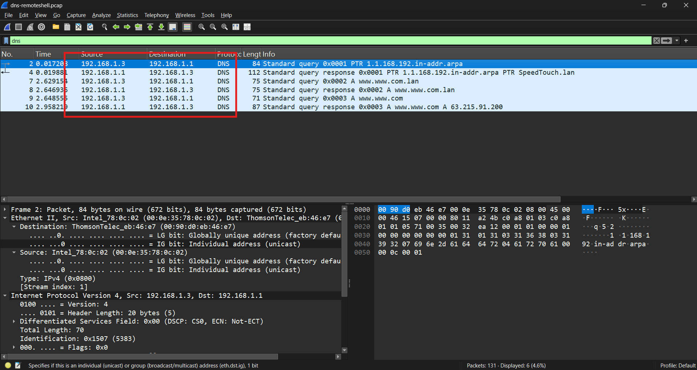
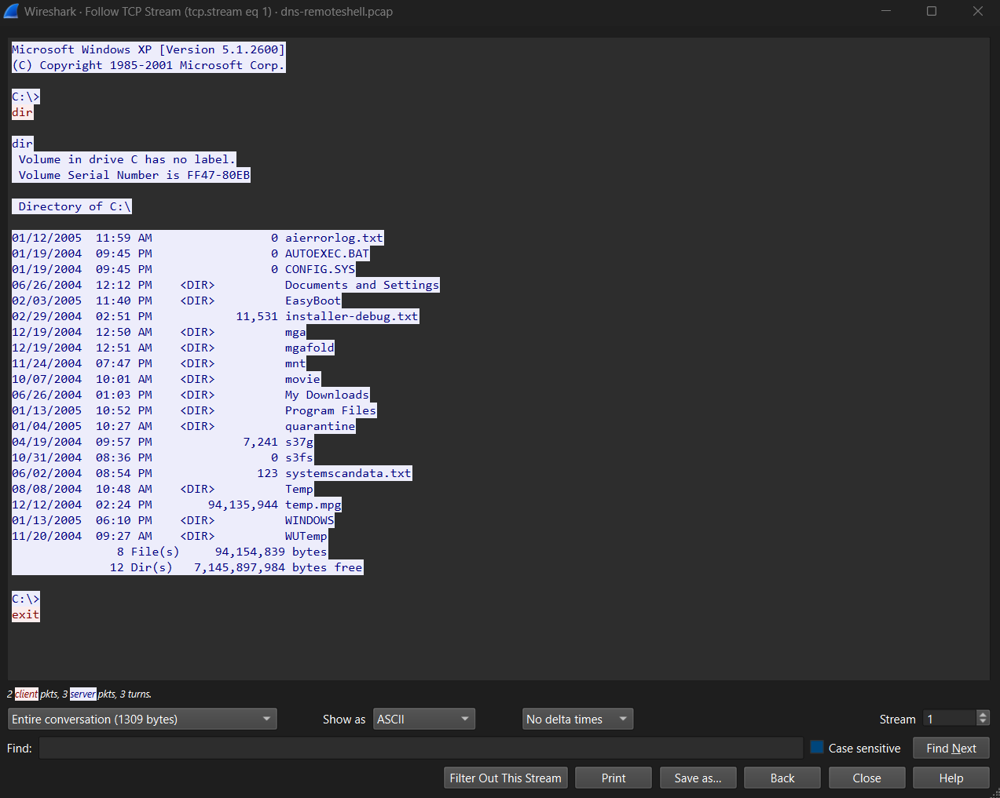

# Remote Shell Traffic Disguised as DNS

## Scenario

This capture contained traffic between three internal hosts, with some activity using port 53.

Since port 53 normally means DNS, I started by looking at the legitimate DNS traffic first. That gave me a baseline to compare against anything suspicious.

What stood out was a TCP connection to port 53 that looked nothing like DNS once I inspected the payload.

## Initial Triage

| Item               | Finding       |
| ------------------ | ------------- |
| Packets            | 131           |
| Suspected Operator | `192.168.1.3` |
| Remote Host        | `192.168.1.2` |
| DNS Server         | `192.168.1.1` |
| Remote OS          | Windows XP    |
| Suspicious Traffic | TCP/53        |

The three hosts involved were:

```text
192.168.1.1
192.168.1.2
192.168.1.3
```

My main goal was to figure out whether the traffic on port 53 was actually DNS.

---

## Establishing Normal DNS Traffic

I started with a basic DNS filter:

```text
dns
```

There were normal DNS requests between:

```text
192.168.1.3 -> 192.168.1.1
```

These packets used UDP/53 and Wireshark decoded them normally as DNS.

Some of the queries included:

```text
1.1.168.192.in-addr.arpa
www.www.com.lan
www.www.com
```

<p align="center">
  
  <br/>
  <em>Normal DNS traffic over UDP/53</em>
</p>

This was useful because it gave me something to compare the suspicious traffic against. Real DNS in this capture had recognizable DNS headers, queries, and responses.

---

## Something Odd on Port 53

Looking through the TCP traffic, I found `192.168.1.3` connecting to:

```text
192.168.1.2:53
```

A useful filter here was:

```text
tcp.port == 53
```

The TCP handshake itself looked normal. The interesting part came when I followed the stream.

Instead of DNS data, the remote system immediately returned:

```text
Microsoft Windows XP [Version 5.1.2600]
(C) Copyright 1985-2001 Microsoft Corp.

C:\>
```

At that point it was clear this was not DNS at all. It was an interactive Windows command shell running over TCP/53.

<p align="center">
  
  <br/>
  <em>Windows command shell discovered over TCP/53</em>
</p>

The operator then entered:

```text
dir
```

and the remote host returned the contents of `C:\`, including:

```text
Documents and Settings
Program Files
WINDOWS
Temp
WUTemp
AUTOEXEC.BAT
CONFIG.SYS
```

The session eventually ended with:

```text
exit
```

Because the connection was completely unencrypted, Wireshark made it possible to reconstruct both the commands and their output directly from the TCP stream.

---

## What Made the Traffic Suspicious?

The biggest indicator was the mismatch between the port and the actual protocol.

Normal traffic in the capture looked like this:

```text
UDP/53 -> DNS
```

The suspicious connection looked like this:

```text
TCP/53 -> Windows command shell
```

Port numbers can tell me what traffic is *expected* to be, but they do not prove what application is actually using the connection.

That was the main lesson from this capture.

---

## Useful Wireshark Filters

```text
# Normal decoded DNS
dns

# UDP DNS traffic
udp.port == 53

# Inspect all TCP traffic using port 53
tcp.port == 53

# Traffic between the two systems
ip.addr == 192.168.1.2 &&
ip.addr == 192.168.1.3

# Look for the Windows command prompt
tcp contains "C:\\"
```

## Indicators Observed

| Type              | Value               |
| ----------------- | ------------------- |
| Operator          | `192.168.1.3`       |
| Remote Host       | `192.168.1.2`       |
| DNS Server        | `192.168.1.1`       |
| Remote OS         | Windows XP 5.1.2600 |
| Shell Transport   | TCP/53              |
| Commands          | `dir`, `exit`       |
| Working Directory | `C:\`               |

These are artifacts from this packet capture rather than general indicators of compromise.

## Takeaway

The interesting part of this capture wasn't simply finding traffic on port 53. It was seeing two completely different types of traffic using the same service port.

The legitimate DNS traffic used UDP/53 and decoded normally in Wireshark. The TCP/53 connection, despite using a DNS-associated port, contained a plaintext Windows shell.

Following the TCP stream made the difference obvious.

This was a good example of why I shouldn't assume a protocol based only on its port number. Looking at the actual application data can reveal activity that would otherwise blend in with normal network traffic.
