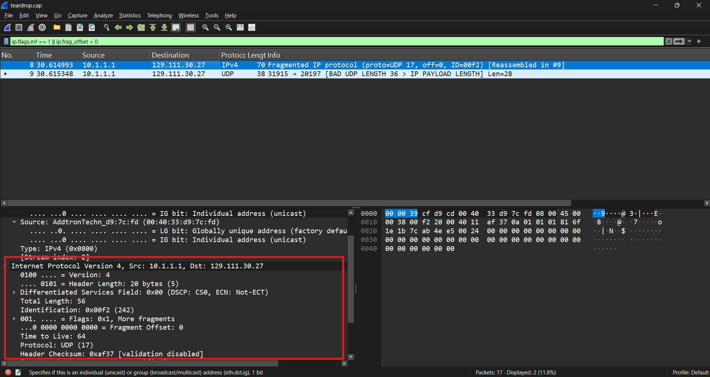
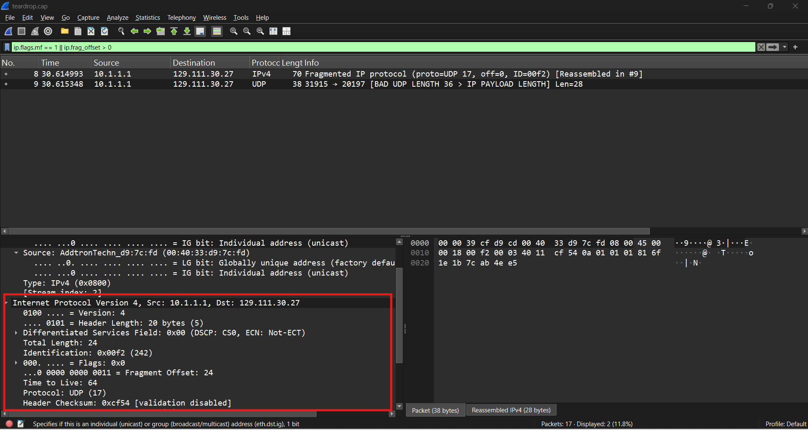

# Teardrop IP Fragmentation Attack

## Scenario

This capture was very small, but two packets stood out because they were fragments of the same IPv4 datagram.

I wanted to figure out whether the fragmentation was normal or malformed.

The suspicious traffic was:

```text id="x8v26m"
10.1.1.1 -> 129.111.30.27
```

Both packets shared the same IP Identification value, which meant they belonged to the same original datagram.

The interesting part came when I compared their offsets.

## Initial Triage

| Item                 | Finding                   |
| -------------------- | ------------------------- |
| Source               | `10.1.1.1`                |
| Target               | `129.111.30.27`           |
| Protocol             | UDP over IPv4             |
| IP Identification    | `242`                     |
| Suspicious Fragments | 2                         |
| Main Finding         | Overlapping fragment data |

Most of the capture was unrelated background traffic, so I focused on the two fragments with IP ID `242`.

---

## First Fragment

The first packet showed:

```text id="aqw7lu"
IP Identification: 242
Fragment Offset: 0
More Fragments: Set
IP Payload Length: 36 bytes
```

<p align="center">
  
  <br/>
  <em>First IPv4 fragment</em>
</p>

Since the fragment starts at offset `0` and contains 36 bytes of IP payload, it covers:

```text id="jx3ps2"
Bytes 0-35
```

Because this is the first fragment, it also contains the UDP header:

```text id="l4r5e9"
Source Port: 31915
Destination Port: 20197
```

So far, nothing looked unusual. The first fragment simply contained the beginning of a larger datagram.

---

## Second Fragment

The next packet had the same:

```text id="tyf16d"
Source IP
Destination IP
Protocol
IP Identification
```

which tied it to the same fragmented datagram.

Its important fields were:

```text id="qz1m4p"
IP Identification: 242
Fragment Offset: 3
More Fragments: Not Set
IP Payload Length: 4 bytes
```

<p align="center">
  
  <br/>
  <em>Second fragment with an overlapping offset</em>
</p>

IPv4 fragment offsets are measured in 8-byte units, so:

```text id="xr39do"
3 × 8 = 24
```

That means this fragment starts at byte `24`.

With a payload length of 4 bytes, it covers:

```text id="knw0ci"
Bytes 24-27
```

That immediately looked wrong.

---

## Finding the Overlap

Comparing the two fragments:

```text id="1at7uk"
Fragment 1: Bytes 0-35
Fragment 2: Bytes 24-27
```

The second fragment starts before the first one has finished.

That means bytes:

```text id="n3oc5c"
24
25
26
27
```

are present in both fragments.

So the overlap is:

```text id="3153t8"
4 bytes
```

This was the main indicator I was looking for.

Instead of cleanly continuing where the first fragment ended, the second fragment supplied data for byte positions that had already been provided.

That malformed overlap is characteristic of a Teardrop-style fragmentation attack.

---

## Why This Matters

Normally, IP fragments should fit together without conflicting with each other.

Something like:

```text id="8z1phk"
Fragment 1: Bytes 0-999
Fragment 2: Bytes 1000-1999
Fragment 3: Bytes 2000-2499
```

In this capture, the layout instead looked like:

```text id="s5i8sl"
Fragment 1: Bytes 0-35
Fragment 2:         Bytes 24-27
```

The receiving system now has two fragments claiming to contain data for the same part of the original packet.

Historically, some operating systems handled malformed overlapping fragments poorly, which made this technique useful for denial-of-service attacks.

Even on modern systems, overlapping fragments are still interesting from a security perspective because different devices may interpret or reassemble them differently.

That can matter when comparing how:

```text id="j8dt2o"
Endpoints
Firewalls
IDS/IPS systems
```

see the same traffic.

---

## Fragment Comparison

| Field              | Fragment 1 | Fragment 2 |
| ------------------ | ---------: | ---------: |
| IP Identification  |      `242` |      `242` |
| Fragment Offset    |        `0` |        `3` |
| Actual Byte Offset |        `0` |       `24` |
| Payload Length     | `36 bytes` |  `4 bytes` |
| More Fragments     |        Set |    Not Set |
| Payload Range      |     `0-35` |    `24-27` |

The matching Identification value showed that the packets belonged to the same datagram.

The overlapping byte ranges showed that the fragmentation was malformed.

---

## Useful Wireshark Filters

```text id="48iixv"
# All fragmented IPv4 traffic
ip.flags.mf == 1 || ip.frag_offset > 0

# Suspicious source
ip.src == 10.1.1.1

# Source and destination
ip.src == 10.1.1.1 &&
ip.dst == 129.111.30.27

# Specific fragmented datagram
ip.id == 0x00f2

# Fragmented UDP traffic
udp || ip.frag_offset > 0
```

Wireshark's fragment reassembly information can also help identify things like:

```text id="u48z8j"
Fragment overlap
Fragment overlap conflict
Reassembled IPv4
```

But the most useful part of this investigation was manually comparing the fragment offset and payload length.

---

## Takeaway

This capture was a good example of how a small amount of traffic can still reveal something important.

Both packets looked like ordinary IPv4 fragments at first. The key was comparing their Identification values, offsets, and payload lengths.

Once I converted the second fragment's offset from `3` to byte `24`, the problem became obvious:

```text id="7cc5aa"
Fragment 1: 0-35
Fragment 2: 24-27
```

The second fragment overlapped four bytes already contained in the first.

That malformed reassembly pattern is what identified the traffic as a Teardrop-style fragmentation attack.
