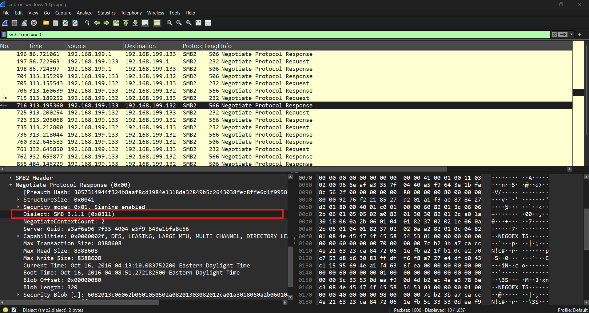
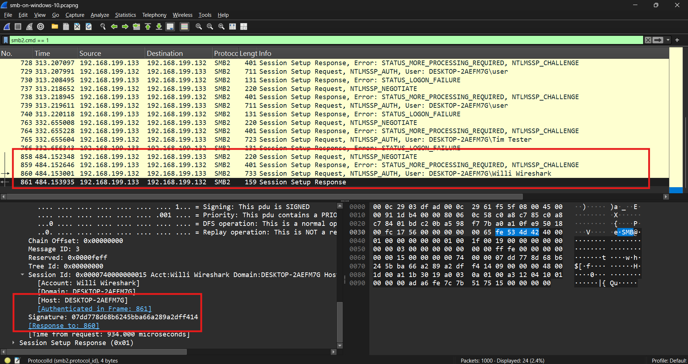
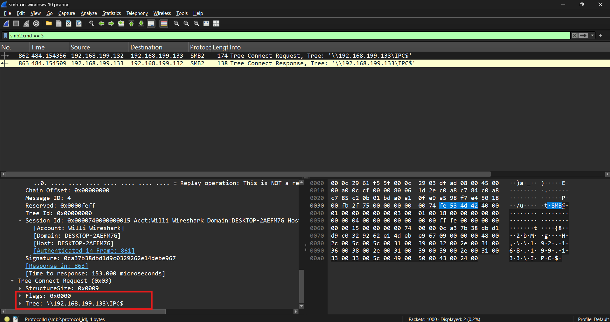
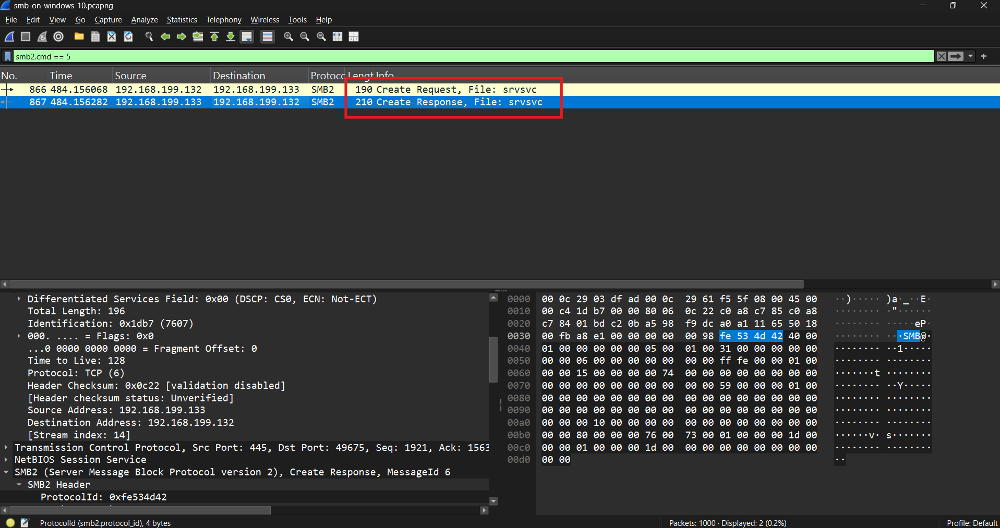

# SMB3 Session Analysis

## Scenario

A packet capture containing Windows SMB traffic was analyzed to understand how a modern SMB session is established and used between two Windows hosts.

The capture includes:

* SMB dialect negotiation
* NTLM authentication
* SMB session establishment
* Connection to the `IPC$` share
* Access to the `srvsvc` named pipe
* SMB read and write operations

The objective was to reconstruct the SMB communication sequence and identify the key protocol stages visible during normal Windows file-sharing and remote service communication.

## Objectives

* Identify the SMB client and server
* Examine SMB dialect negotiation
* Determine the selected SMB version
* Examine authentication behavior
* Identify the connected share
* Identify named-pipe access
* Observe SMB read/write operations
* Develop useful Wireshark filters for SMB analysis

## Initial Triage

| Item               | Finding           |
| ------------------ | ----------------- |
| Total Packets      | 1,000             |
| Capture Duration   | ~668.7 seconds    |
| SMB Client         | `192.168.199.132` |
| SMB Server         | `192.168.199.133` |
| SMB Port           | TCP/445           |
| Negotiated Dialect | SMB 3.1.1         |
| Authentication     | NTLMSSP           |
| Share Accessed     | `IPC$`            |
| Named Pipe         | `srvsvc`          |

The primary SMB session of interest occurs between:

```text
192.168.199.132 -> 192.168.199.133:445
```

This identifies `192.168.199.132` as the SMB client and `192.168.199.133` as the server for the session analyzed below.

---

## Analysis

### 1. SMB Connection Identified

Modern SMB commonly operates directly over:

```text
TCP/445
```

Filtering for:

```text
tcp.port == 445
```

reveals multiple TCP connections between:

```text
192.168.199.132
192.168.199.133
```

The successful SMB session uses a client ephemeral port connecting to TCP port 445 on `192.168.199.133`.

A more focused Wireshark filter is:

```text
ip.addr == 192.168.199.132 &&
ip.addr == 192.168.199.133 &&
tcp.port == 445
```

---

### 2. SMB Dialect Negotiation

After the TCP connection is established, the client sends an SMB2:

```text
NEGOTIATE Request
```

The request advertises support for several SMB dialects:

```text
SMB 2.0.2
SMB 2.1
SMB 3.0
SMB 3.0.2
SMB 3.1.1
```

At the protocol level, the dialect values include:

```text
0x0202
0x0210
0x0300
0x0302
0x0311
```

The server responds with a:

```text
NEGOTIATE Response
```

selecting:

```text
0x0311
```

which corresponds to:

```text
SMB 3.1.1
```

This demonstrates how an SMB client and server determine the highest mutually supported dialect before continuing with authentication.

<p align="center">
  
  <br/>
  <em>SMB 3.1.1</em>
</p>

Useful filter:

```text
smb2.cmd == 0
```

or simply:

```text
smb2
```

and inspect packets labeled:

```text
Negotiate Protocol Request
Negotiate Protocol Response
```

---

### 3. Session Authentication Begins

Following negotiation, the client sends:

```text
SESSION_SETUP Request
```

The authentication data contains:

```text
NTLMSSP
```

indicating the use of NTLM authentication.

The server initially responds with:

```text
STATUS_MORE_PROCESSING_REQUIRED
```

represented by:

```text
0xC0000016
```

This is expected during NTLM challenge-response authentication and does not by itself indicate an error.

The client then sends another `SESSION_SETUP` message containing additional NTLM authentication data.

The capture exposes Windows host information in this exchange, including names such as:

```text
DESKTOP-2AEFM7G
DESKTOP-V1FA0UQ
```

and a user-related string:

```text
Willi Wireshark
```

This demonstrates that authentication exchanges can expose useful host and identity metadata even when credentials themselves are not transmitted in plaintext.

<p align="center">
  
  <br/>
  <em>NTLM Session Setup</em>
</p>

---

### 4. Failed Authentication Attempts

Several earlier SMB authentication sequences do not complete successfully.

The server returns:

```text
STATUS_LOGON_FAILURE
```

with status:

```text
0xC000006D
```

after some `SESSION_SETUP` exchanges.

These unsuccessful attempts are followed by new SMB connections and additional authentication attempts.

Eventually, a later session completes successfully.

This distinction is useful during incident analysis because repeated SMB authentication failures can indicate:

* Mistyped credentials
* Expired credentials
* Automated authentication attempts
* Password spraying
* Lateral movement attempts

In this capture, however, the packets alone establish only that multiple authentication attempts occur; they do not establish malicious intent.

---

### 5. Successful SMB Session

A later authentication exchange receives:

```text
STATUS_SUCCESS
```

from the server.

At this point, the client has established a valid SMB session with:

```text
192.168.199.133
```

The subsequent packets progress beyond authentication into resource access.

The sequence can be summarized as:

```text
TCP Connection
      ↓
SMB NEGOTIATE
      ↓
SMB SESSION_SETUP
      ↓
NTLM Authentication
      ↓
Successful Session
```

---

### 6. IPC$ Tree Connection

Once authentication succeeds, the client sends an SMB:

```text
TREE_CONNECT Request
```

for:

```text
\\192.168.199.133\IPC$
```

The server responds successfully.

<p align="center">
  
  <br/>
  <em>Tree Connectionp</em>
</p>


`IPC$` is a special Windows administrative share used for interprocess communication rather than ordinary file storage.

It is commonly involved in:

* Named-pipe communication
* RPC
* Windows administrative operations
* Service enumeration
* Remote management

The presence of `IPC$` by itself is normal in Windows environments.

Useful Wireshark filter:

```text
smb2.cmd == 3
```

---

### 7. Named-Pipe Access

Following the `IPC$` connection, the client issues an SMB:

```text
CREATE Request
```

for:

```text
srvsvc
```

This refers to the Windows Server Service RPC named pipe.

The server responds successfully, allowing subsequent communication through the pipe.

`srvsvc` is associated with Server Service RPC functionality and may be used for operations such as:

* Enumerating shares
* Querying server information
* Accessing Windows networking information

The sequence is therefore:

```text
TREE_CONNECT -> IPC$
        ↓
CREATE -> srvsvc
        ↓
RPC-related communication
```

---

### 8. SMB IOCTL Activity

The session also contains:

```text
IOCTL Request
IOCTL Response
```

messages.

SMB IOCTL operations allow clients to issue control requests to a server or an opened resource.

These messages commonly appear during named-pipe and RPC-related SMB communication.

The presence of IOCTL traffic following an `IPC$` tree connection is therefore consistent with Windows interprocess communication.

---

### 9. SMB Read and Write Operations

After opening the named pipe, the client begins exchanging:

```text
WRITE
READ
```

requests with the server.

The sequence includes:

```text
WRITE Request
WRITE Response

READ Request
READ Response

WRITE Request
WRITE Response

READ Request
READ Response
```

The requests originate from:

```text
192.168.199.132
```

and the responses originate from:

```text
192.168.199.133
```

<p align="center">
  
  <br/>
  <em>Tree Connectionp</em>
</p>

These SMB operations carry the data exchanged through the opened `srvsvc` pipe.

This demonstrates that SMB acts as the transport mechanism for higher-level Windows communication rather than simply transferring files.

---

## SMB Session Sequence

The successful session can be summarized as:

```text
192.168.199.132                     192.168.199.133
      |                                    |
      | -------- TCP connection --------> |
      |                                    |
      | ------ SMB NEGOTIATE -----------> |
      | <----- SMB 3.1.1 selected ------- |
      |                                    |
      | ------ SESSION_SETUP -----------> |
      | <--- NTLM challenge/response ----- |
      |                                    |
      | ------ SESSION_SETUP -----------> |
      | <------ STATUS_SUCCESS ----------- |
      |                                    |
      | ------ TREE_CONNECT ------------> |
      |        \\server\IPC$               |
      | <--------- Success --------------- |
      |                                    |
      | ------ CREATE srvsvc ------------> |
      | <--------- Success --------------- |
      |                                    |
      | ------- WRITE / READ ------------> |
      | <------ WRITE / READ ------------- |
```

---

## SMB Commands Observed

| SMB Command     | Purpose                               |
| --------------- | ------------------------------------- |
| `NEGOTIATE`     | Select SMB dialect and capabilities   |
| `SESSION_SETUP` | Authenticate and create a session     |
| `TREE_CONNECT`  | Connect to an SMB share               |
| `IOCTL`         | Send control operations               |
| `CREATE`        | Open a file, directory, or named pipe |
| `QUERY_INFO`    | Request information about an object   |
| `WRITE`         | Send data                             |
| `READ`          | Retrieve data                         |
| `CLOSE`         | Close an opened object                |

---

## Indicators and Artifacts

| Type                          | Value             |
| ----------------------------- | ----------------- |
| SMB Client                    | `192.168.199.132` |
| SMB Server                    | `192.168.199.133` |
| Server Port                   | TCP/445           |
| SMB Version                   | SMB 3.1.1         |
| Authentication                | NTLMSSP           |
| Successful Share              | `IPC$`            |
| Named Pipe                    | `srvsvc`          |
| Authentication Failure Status | `0xC000006D`      |
| NTLM Intermediate Status      | `0xC0000016`      |

These values represent artifacts of the sample environment and are not general indicators of compromise.

---

## Security Significance

SMB is an important protocol for both legitimate Windows administration and attacker activity.

The same SMB operations visible in this capture can also appear during:

* Remote administration
* Lateral movement
* Share enumeration
* Credential attacks
* Remote service interaction
* Named-pipe communication

For that reason, detecting malicious SMB activity requires context.

For example:

```text
IPC$ connection
```

or:

```text
srvsvc access
```

should not automatically be treated as malicious.

Instead, an analyst should consider:

* Which host initiated the connection
* Which user authenticated
* Whether authentication repeatedly failed
* Which shares or named pipes were accessed
* What activity occurred before and after the SMB connection
* Whether the behavior is expected for the systems involved

This capture provides a useful baseline for understanding what legitimate SMB session establishment looks like before attempting to identify malicious SMB behavior.

---

## Useful Wireshark Filters

```text
# All SMB2/SMB3 traffic
smb2

# SMB traffic between the two hosts
ip.addr == 192.168.199.132 &&
ip.addr == 192.168.199.133 &&
tcp.port == 445

# SMB negotiation
smb2.cmd == 0

# Session setup
smb2.cmd == 1

# Tree connections
smb2.cmd == 3

# File or named-pipe creation
smb2.cmd == 5

# Read operations
smb2.cmd == 8

# Write operations
smb2.cmd == 9

# IOCTL
smb2.cmd == 11

# Query information
smb2.cmd == 16
```

## Conclusion

Analysis of the packet capture identified an SMB3 session between client `192.168.199.132` and server `192.168.199.133` over TCP port 445.

During SMB negotiation, the client advertised support for SMB versions ranging from SMB 2.0.2 through SMB 3.1.1. The server selected SMB 3.1.1.

Authentication then proceeded using NTLMSSP. Several earlier session attempts resulted in `STATUS_LOGON_FAILURE`, while a later exchange successfully established an authenticated SMB session.

The client subsequently connected to:

```text
\\192.168.199.133\IPC$
```

and opened the:

```text
srvsvc
```

named pipe.

The session then contained SMB IOCTL, write, read, query, and close operations consistent with Windows interprocess and RPC-related communication.

This analysis demonstrates the complete lifecycle of a modern SMB session and provides a baseline for recognizing SMB negotiation, authentication, administrative shares, named pipes, and subsequent data exchange in network traffic.
