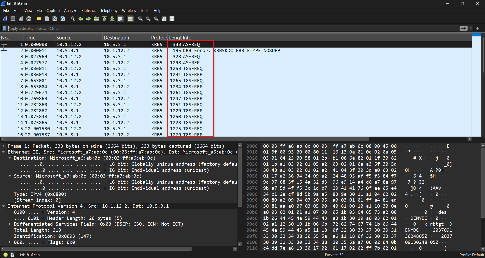
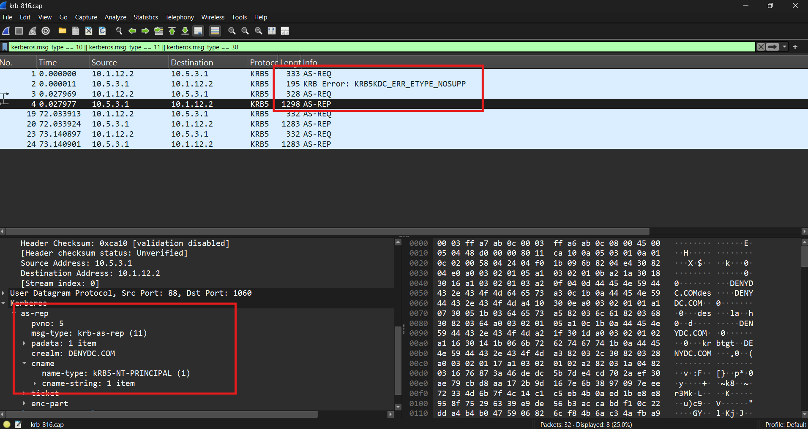
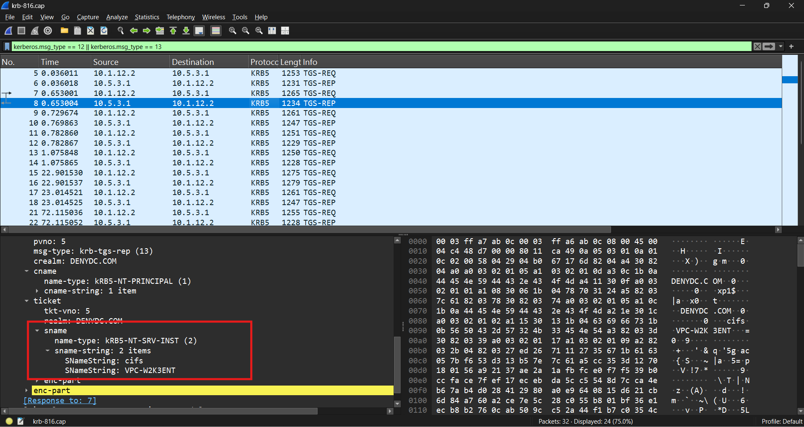
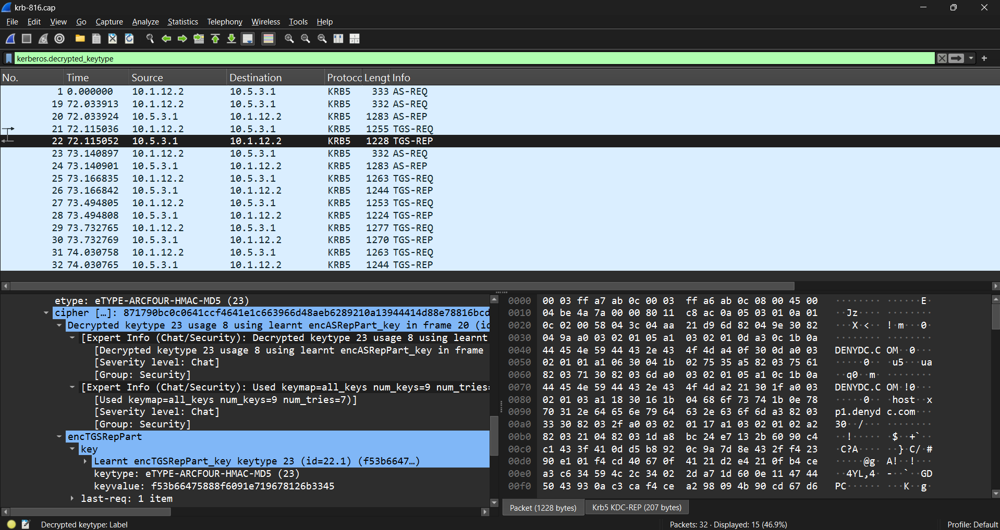

# Kerberos Authentication and Service Ticket Analysis

## Scenario

This capture contained Kerberos traffic from a Windows domain environment.

I wanted to follow the authentication process from the client's first request through the point where it began requesting tickets for individual services.

The traffic also came with a Kerberos keytab, which gave me a chance to see what additional information Wireshark could decrypt.

## Initial Triage

| Item               | Finding          |
| ------------------ | ---------------- |
| Client             | `10.1.12.2`      |
| KDC                | `10.5.3.1`       |
| Protocol           | Kerberos         |
| Transport          | UDP/88           |
| Realm              | `DENYDC.COM`     |
| Principals         | `des`, `u5`      |
| Services Requested | HOST, CIFS, LDAP |

All of the traffic in the capture was between:

```text
10.1.12.2 <-> 10.5.3.1
```

A simple filter:

```text
kerberos
```

isolated the entire capture.

---

## Getting Oriented

The first thing I noticed was that most of the traffic fell into four message types:

```text
AS-REQ
AS-REP
TGS-REQ
TGS-REP
```

<p align="center">
  
  <br/>
  <em>Kerberos authentication traffic in the capture</em>
</p>

The easiest way for me to think about the sequence was:

```text
AS exchange  -> get a TGT
TGS exchange -> use the TGT to request service tickets
```

So I started with the first AS request and followed the session from there.

---

## Initial Authentication Attempt

The first packet was an `AS-REQ` from:

```text
10.1.12.2 -> 10.5.3.1
```

for the principal:

```text
des
```

in the `DENYDC.COM` realm.

The request was ultimately asking for a ticket to:

```text
krbtgt/DENYDC.COM
```

which is the Ticket Granting Service account.

Instead of immediately returning a ticket, the KDC responded with:

```text
KRB-ERROR
KDC_ERR_ETYPE_NOSUPP
```

The error code was:

```text
14
```

This told me the initial request included an encryption type the KDC didn't support.

The client then tried again with another `AS-REQ`.

---

## TGT Successfully Issued

The second authentication attempt succeeded.

The KDC returned an:

```text
AS-REP
```

for:

```text
Client: des
Realm: DENYDC.COM
```

and the ticket inside the response was for:

```text
krbtgt/DENYDC.COM
```

<p align="center">
  
  <br/>
  <em>Successful AS exchange resulting in a Ticket Granting Ticket</em>
</p>

At this point, the client had its Ticket Granting Ticket.

The sequence so far was:

```text
des
 |
 | AS-REQ
 v
KDC
 |
 | KRB-ERROR
 v
des
 |
 | AS-REQ
 v
KDC
 |
 | AS-REP
 v
TGT
```

That made the later packets much easier to understand.

---

## Requesting Service Tickets

After receiving the TGT, the client began sending `TGS-REQ` messages.

Instead of authenticating from scratch again, the client used the TGT to request tickets for individual services.

The KDC returned each one in a:

```text
TGS-REP
```

This was where the capture started showing what resources the client actually wanted to access.

---

## HOST Ticket

One request was for:

```text
host/xp1.denydc.com
```

The flow looked like:

```text
TGT
 |
 | TGS-REQ
 v
KDC
 |
 | TGS-REP
 v
host/xp1.denydc.com
```

The important thing here was that Kerberos wasn't simply issuing a generic "access this computer" ticket.

The ticket was tied to a specific service principal.

---

## CIFS Tickets

I also found several requests for CIFS:

```text
cifs/VPC-W2K3ENT
```

and:

```text
cifs/vpc-w2k3ent.denydc.com
```

<p align="center">
  
  <br/>
  <em>CIFS service ticket returned by the KDC</em>
</p>

Since CIFS is used by SMB, these tickets would allow the client to authenticate to the server's file-sharing service using Kerberos.

The flow was essentially:

```text
TGT
 |
 | Request CIFS service ticket
 v
KDC
 |
 | TGS-REP
 v
CIFS ticket
```

---

## LDAP Tickets

The capture also contained requests for LDAP services:

```text
LDAP/vpc-w2k3ent.denyDC.com
```

and:

```text
ldap/vpc-w2k3ent.denyDC.com/denyDC.com
```

That fit with normal Active Directory activity, since LDAP is heavily used for directory queries and domain operations.

At this point the pattern became clear: one successful authentication could lead to several service-ticket requests without the user having to authenticate again each time.

The services I observed were:

| Service  | Purpose                             |
| -------- | ----------------------------------- |
| `krbtgt` | Ticket Granting Ticket              |
| `host`   | Windows host services               |
| `cifs`   | SMB / file sharing                  |
| `ldap`   | Active Directory directory services |

---

## Another Principal Appears

Later in the capture, a second principal appeared:

```text
u5@DENYDC.COM
```

The KDC returned an `AS-REP` for this account as well.

More TGS requests followed for services such as:

```text
host
ldap
cifs
```

This showed that the capture wasn't just one user's authentication session. Multiple principals were using the same KDC to obtain their own tickets.

---

## Using the Keytab

The capture also came with a Kerberos keytab containing entries for:

```text
des@DENYDC.COM
u5@DENYDC.COM
```

The two entries used different encryption types:

```text
des -> DES-CBC-MD5
u5  -> RC4-HMAC
```

After loading the keytab into Wireshark, I could inspect decrypted Kerberos structures where the supplied keys matched the traffic.

<p align="center">
  
  <br/>
  <em>Kerberos data decrypted using the supplied keytab</em>
</p>

This exposed additional fields inside the encrypted portions of the ticket exchange, including things like:

```text
key
last-req
nonce
flags
```

That was useful because it showed the difference between what is visible from normal Kerberos dissection and what becomes available once the relevant key material is provided.

---

## Authentication Flow

Putting the main sequence together:

```text
Client                                  KDC
  |                                      |
  | ------------ AS-REQ --------------> |
  |                                      |
  | <----------- KRB-ERROR ------------- |
  |                                      |
  | ------------ AS-REQ --------------> |
  |                                      |
  | <------------ AS-REP --------------- |
  |                TGT                   |
  |                                      |
  | ------------ TGS-REQ --------------> |
  |          TGT + service SPN           |
  |                                      |
  | <------------ TGS-REP ---------------|
  |            Service Ticket            |
  |                                      |
```

The TGS portion can repeat for every service the client needs.

---

## Useful Wireshark Filters

```text
# All Kerberos traffic
kerberos

# Kerberos communication with the KDC
udp.port == 88

# AS-REQ
kerberos.msg_type == 10

# AS-REP
kerberos.msg_type == 11

# TGS-REQ
kerberos.msg_type == 12

# TGS-REP
kerberos.msg_type == 13

# Kerberos errors
kerberos.msg_type == 30

# Client/KDC communication
ip.addr == 10.1.12.2 &&
ip.addr == 10.5.3.1
```

## Takeaway

The most useful part of this capture was seeing Kerberos as a sequence rather than just a collection of ticket packets.

The client first tried to authenticate and received an encryption-type error. A second request succeeded and returned a TGT.

From there, that TGT was reused to request tickets for individual services such as HOST, CIFS, and LDAP.

Loading the supplied keytab also showed how much more detail becomes available when Wireshark has the right key material.

Working through the exchange made the relationship between TGTs and service tickets much clearer, and it gave me a better baseline for what normal Kerberos activity looks like before trying to identify things like Kerberoasting, Pass-the-Ticket, or other ticket-based attacks.
